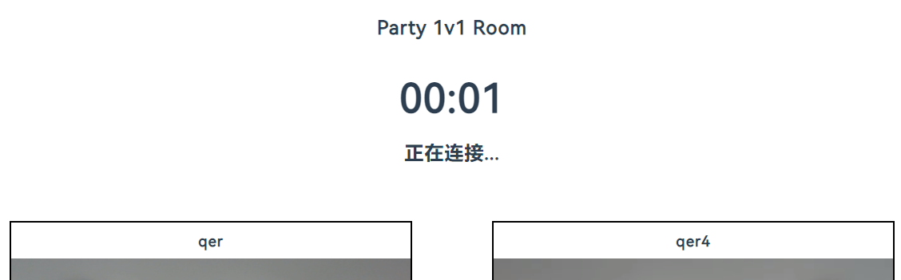

# Online Party

(inspired by Run the world)

## Introduction

Online Party 是一款用于线上聚会，陌生人 1v1 音视频聊天的社交 web 应用。

## How to use it

### 1 Party owner 创建一个 Party

需要输入的信息有：

1. 用户名
2. Party 号码 （进入此 Party 的唯一标识）
3. Party 名称
4. 开始时间（若在开始之前进入 Party，则进入等候室；若在开始之后进入 Party，则直接进入匹配房）
5. 一句话介绍
6. 内测邀请码（防止滥用房间资源，此处增加简单限制，如有需要可联系 qer 获得）

### 2 其他 Party 参与者根据 owner 创建的 <Party 号码> 进入 Party

### 3 Party 未开始，进入等候室

若在开始之前进入 Party，则进入等候室；若在开始之后进入 Party，则直接进入匹配房。

在等候室可以实时看到此时房间内有哪些人，并且可在房间内面向全体聊天。

### 4 Party 开始之后，会进入匹配房间

在此房间中，默认会进行两轮匹配。

对于每一轮匹配由三个阶段组成：

1. 匹配时间 10s
2. 连接时间 4s
3. 1v1 音视频通话时间 180s=3min

以上时间均可从代码中自由修改。

目前发起匹配的逻辑代码在 owner 端，所以暂时的匹配逻辑为：一旦 owner 在开始时间之后进入房间，则大伙开始匹配，否则等待 owner 进入。

匹配页面：

连接准备页面：

RTC 1v1 音视频页面：

### 5 散场结束页面

此页面可以回顾本次 Party 所遇到过的所有的人，并且可在房间内面向全体聊天。

